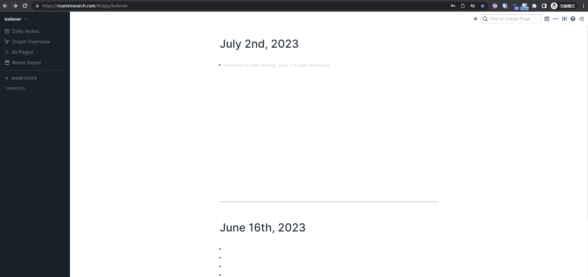

# roam-save-scrollbar-position

A simple Roam Research extension that saves the position of the scrollbar on each page, and when you return to this page, it reverts to the position you last viewed.

It just saves the position of the scrollbar in the browser's memory, so when you refresh the browser, the last saved data will be cleared.

Demo1:

Demo2:

